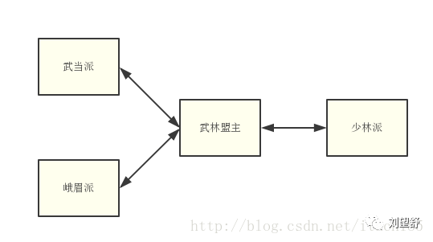

参考: https://mp.weixin.qq.com/s/iJ1GYc1tIlIO5WNJ9sekWA

中介者模式可以拿武侠来举例，江湖中门派众多，门派之前因为想法不同会有很多的利益冲突，这样就会带来无休止的纷争。为了江湖的安宁，大家推举出了一个大家都认可的武林盟主来对江湖纷争进行调停。
前段时间武当派和峨眉派的的弟子被大力金刚指所杀，大力金刚指是少林派的绝学，因为事情重大，而且少林派实力强大，武当派和峨眉派不能够直接去少林派去问罪，只能上报武林盟主由武林盟主出面进行调停，如下图所示。

武当、峨眉和少林类都有两个方法，其中getNotice方法是自有方法，对于其他的门派（同事类）和武林联盟（中介者）没有依赖，只是用来接收武林盟主的通知。sendAlliance方法则是依赖方法，它必须通过武林盟主才能完成行为。